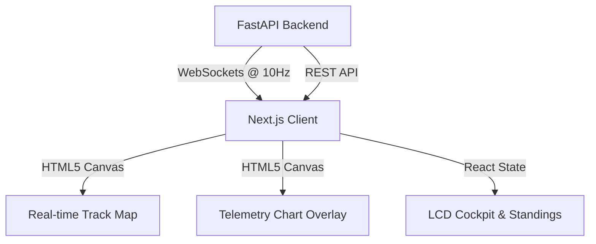

# F1 Race Telemetry & Strategy Dashboard

A real-time, high-performance Formula 1 race replay and telemetry visualization dashboard. This project replaces the legacy Flutter implementation with a high-performance Next.js client and a FastAPI backend to deliver smooth, 60 FPS rendering.

## Architecture



- **Backend**: FastAPI (Python) server broadcasting live telemetry and race coordinates at 10 Hz (every 100ms).
- **Frontend**: Next.js (React + TypeScript) app utilizing direct HTML5 Canvas rendering for the track map, comparison telemetry charts, and cockpit displays to achieve lag-free, smooth animations.

## Getting Started

### 1. Run the Backend
Ensure you have the dependencies installed:
```bash
cd backend
pip install -r requirements.txt  # If requirements.txt exists
python3 -m uvicorn main:app --host 127.0.0.1 --port 8000
```

### 2. Run the Frontend
Initialize and run the Next.js development server:
```bash
cd frontend
npm install
npm run dev
```
Open [http://localhost:3000](http://localhost:3000) with your browser.

## Features

- **High-Performance Canvas Rendering**: All telemetry curves (Speed, RPM, Gear, Throttle, Brake, ERS) and the interactive track map are rendered using custom HTML5 canvas contexts inside `requestAnimationFrame` loops, bypassing React layout overhead.
- **Comparative Telemetry**: Overlay two drivers' lap telemetry curves with synchronized hover/scrub controls to inspect throttle/brake inputs and speed delta profiles.
- **Steering LCD Cockpit**: Live visual gear display, shift lights, RPM bar, throttle/brake gauges, and ERS states.
- **Race Controls**: Play/pause, speed multipliers, and jump-to-time capabilities with instant state freezing.
- **AI Insights & Feeds**: LLM/AI race engineer commentary and live event logs synchronized to the replay timeline.
